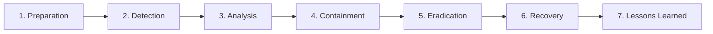

# Cybersecurity Incident Response Simulation Platform (Mini-SOC / SIEM)

A complete, beginner-friendly, and professional **Cybersecurity Incident Response Simulation** web application built for a **B.Tech Cybersecurity Academic Capstone / Major Project**.

---

## 1. Project Objective

The primary objective of this project is to simulate an enterprise cybersecurity incident and perform hands-on Security Operations Center (SOC) analysis using standardized Windows Security & SIEM logs. 

The application enables cybersecurity students and evaluators to:
- Ingest and inspect realistic Windows Security Event logs (Events `4624`, `4625`, `4688`, `4672`, `7045`, `1102`).
- Execute real-time rule-based detection algorithms for Brute Force, Compromised Authentication, Malicious PowerShell execution, and Privilege Escalation.
- Identify and catalog Indicators of Compromise (IOCs) across network, host, and identity vectors.
- Manage an end-to-end Incident Investigation Room with chronological timeline reconstruction.
- Execute simulated mitigation and containment playbooks following NIST SP 800-61 / SANS 6-Phase Incident Handling methodologies.
- Generate and export formal executive incident reports to PDF.

> **Educational Safety Notice:**  
> This project operates strictly inside an isolated educational sandbox using synthetic logs and RFC 1918 private IP addresses (`192.168.10.x`, `10.0.0.x`). It contains **NO real malware, exploit code, password cracking tools, or destructive commands**.

---

## 2. Features

- **SOC Dark-Theme UI & Dashboard:** Modern SOC look-and-feel with glowing alert badges, responsive sidebar, and real-time incident status pill.
- **Interactive Security Analytics (Chart.js):**
  - Authentication Timeline (Logon vs Failed Logon over time)
  - Auth Ratio Doughnut Chart (4624 vs 4625 vs system events)
  - Event Severity Breakdown (LOW, MEDIUM, HIGH, CRITICAL)
  - MITRE ATT&CK Attack Progression Stage Tracker
- **Windows SIEM Log Explorer:** Filterable and searchable log table with multi-criteria filters (Severity, Event ID, Source IP), quick-filter presets, and a raw Windows JSON/XML event modal inspector.
- **Rule-Based SIEM Detection Engine:** Implements 5 detection rules with MITRE ATT&CK mapping and viva-ready logic explanations.
- **Threat Intelligence & IOC Matrix:** Track malicious IPs, compromised usernames, LOLBINs, file hashes (SHA-256), URLs, and persistence services.
- **Incident Investigation Room:** Interactive 6-stage chronological timeline, correlated suspicious log feed, and live analyst notebook with AJAX persistence.
- **NIST/SANS 6-Phase Containment Playbook:** Interactive checklist (Pending, In Progress, Completed) and a simulated SOC terminal console that prints safe command outputs.
- **Formal Incident Report Generator:** Comprehensive report with executive summary, timeline, IOC matrix, response measures, and strategic recommendations, optimized for clean PDF export / printing via `@media print`.
- **One-Click Simulation Reset:** Allows students to reset and re-demonstrate the simulation repeatedly during viva presentations.

---

## 3. Technology Stack

- **Frontend:** HTML5, CSS3 (SOC Dark Theme with Glassmorphism and Print CSS), Vanilla JavaScript (ES6+), FontAwesome 6.4 Icons.
- **Analytics Visualization:** Chart.js v4.x for real-time security dashboards.
- **Backend:** Python 3 (Flask Framework, Jinja2 template engine, Werkzeug).
- **Database:** SQLite 3 (`incident_response.db`) with tables for users, logs, anomalies, iocs, incidents, notes, and response actions.
- **Security Standards:** NIST SP 800-61 Rev 2, SANS Incident Response Framework, MITRE ATT&CK Enterprise Matrix.

---

## 4. Folder Structure

```
cybersecurity-incident-response-sim/
├── app.py                     # Flask application routes, metrics, and REST API endpoints
├── database.py                # SQLite schema definition and automated mock data seeder
├── detector.py                # Rule-based SIEM detection engine & MITRE ATT&CK mapping
├── requirements.txt           # Python dependency specifications
├── test_app.py                # Automated unit test suite verifying database, rules, and routes
├── README.md                  # Complete academic documentation and viva preparation guide
├── incident_response.db       # SQLite database (auto-generated on startup)
├── static/
│   ├── css/
│   │   └── style.css          # Dark SOC styles, glowing badges, animations, print media
│   └── js/
│       ├── main.js            # Client-side filtering, modals, containment execution, notes, toasts
│       └── charts.js          # Chart.js security analytics graphs and timeline visualizers
└── templates/
    ├── base.html              # Core layout with sidebar, header, alert ticker, and required footer
    ├── dashboard.html         # Page 1: Overview KPIs, 4 security analytics charts, recent alerts
    ├── logs.html              # Page 2: SIEM Log Explorer with dynamic search, filters, and JSON modal
    ├── anomalies.html         # Page 3 & 8: Rule-Based Anomaly Detection with viva logic breakdowns
    ├── iocs.html              # Page 4: Threat Intelligence & IOC Detection Matrix with disclaimer
    ├── incidents.html         # Page 5: Incidents list directory
    ├── incident_detail.html   # Page 5: Deep Incident Investigation Room with timeline & notes
    ├── response.html          # Page 6: NIST/SANS 6-phase Response Workflow & interactive console
    └── report.html            # Page 7: Comprehensive Incident Report generator with PDF export
```

---

## 5. Installation Steps

### Prerequisites
- Python 3.8 or higher installed on Windows, macOS, or Linux.
- Modern web browser (Chrome, Firefox, Safari, or Edge).

### Step 1: Clone or Navigate to the Project Directory
```bash
cd cybersecurity-incident-response-sim
```

### Step 2: Create and Activate a Python Virtual Environment
**On macOS/Linux:**
```bash
python3 -m venv venv
source venv/bin/activate
```

**On Windows:**
```cmd
python -m venv venv
venv\Scripts\activate
```

### Step 3: Install Dependencies
```bash
pip install -r requirements.txt
```

---

## 6. How to Run the Flask Application

### Step 1: Initialize Database (Optional, runs automatically on startup)
```bash
python database.py
```

### Step 2: Launch the Web Application
```bash
python app.py
```

### Step 3: Access the SOC Dashboard
Open your web browser and navigate to:
```
http://127.0.0.1:5000/
```

### Step 4: Run Automated Tests
```bash
python test_app.py
```

---

## 7. Sample Incident Scenario

### Incident ID: `INC-2026-001`
### Title: *Suspected Account Compromise and Privilege Escalation*

#### Attack Narrative:
1. **Initial Access / Credential Guessing:**  
   An unauthorized actor located on internal host `192.168.10.45` initiates an automated password guessing attack against employee account `jdoe` on workstation `WS-FIN-042` (`192.168.10.105`), generating 6 rapid failed logons (**Event ID 4625**).
2. **Successful Logon:**  
   At `09:43:10`, a successful RemoteInteractive session (**Event ID 4624**) is established using compromised credentials.
3. **Execution & Web Cradle:**  
   The actor spawns `powershell.exe` (**Event ID 4688**) with `-ExecutionPolicy Bypass` and Base64 `-EncodedCommand` flags to download a reconnaissance script `http://192.168.10.45/script.ps1`.
4. **Privilege Escalation:**  
   The actor assigns special administrator privileges (**Event ID 4672**, `SeDebugPrivilege`) and executes `net localgroup administrators jdoe /add` to achieve local administrator control.
5. **Persistence Mechanism:**  
   A new Windows service `SimSecUpdateSvc` pointing to `C:\Windows\Temp\svc_update.exe` is installed (**Event ID 7045**).
6. **Defense Evasion:**  
   The actor attempts to clear the Windows Security Event Log (**Event ID 1102**) to hide evidence, generating a critical SIEM alert.

---

## 8. Indicators of Compromise (IOCs) Detected

| IOC Type | Indicator Value (Simulated) | Detection Reason | Severity |
| :--- | :--- | :--- | :--- |
| **IP Address** | `192.168.10.45` | Attacker host launching brute-force and remote session | **HIGH** |
| **User Account** | `jdoe` | Compromised Finance employee domain account | **HIGH** |
| **Process / Binary** | `powershell.exe` | LOLBIN executing encoded download cradle arguments | **HIGH** |
| **File Hash (SHA-256)** | `e3b0c44298fc1c149afbf4c8996fb...` | Staged reconnaissance script payload in Temp directory | **CRITICAL** |
| **Internal URL** | `http://192.168.10.45/script.ps1` | Web cradle download URI for second-stage payload | **HIGH** |
| **Event ID** | `4625` / `4672` / `1102` | SIEM signature patterns for brute force & privilege abuse | **CRITICAL** |
| **Service Name** | `SimSecUpdateSvc` | Unauthorized service created for persistence | **CRITICAL** |

---

## 9. Response and Containment Process

The platform guides the analyst through the **NIST SP 800-61 / SANS 6-Phase Incident Response Lifecycle**:



### Safe Simulated Actions in Console:
1. **Host Isolation:** Disconnect network interface on `WS-FIN-042` and switch to quarantine VLAN.
2. **Account Disablement:** Disable Active Directory account `jdoe` and revoke active Kerberos/NTLM tickets.
3. **Firewall Blocking:** Commit rule `DROP ALL from 192.168.10.45` on core firewall.
4. **Process Termination:** Terminate process tree for `powershell.exe` (PID 4892) and `cmd.exe`.
5. **Privilege Revocation:** Strip unauthorized accounts from local Administrators group and purge `SimSecUpdateSvc`.
6. **Credential Reset & MFA:** Force password change and enforce hardware Multi-Factor Authentication.
7. **Forensic Evidence Preservation:** Capture memory snapshot and export tamper-proof SIEM logs.

---

## 10. Expected Output & Pages Overview

1. **Dashboard (`/dashboard`):** 5 KPI cards, 4 interactive Chart.js security graphs, and recent alert streams.
2. **Log Analysis (`/logs`):** 30+ simulated logs with live multi-column filtering, search, and raw JSON modal inspector.
3. **Suspicious Activity & Anomalies (`/anomalies`):** Detected rule cards with MITRE ATT&CK mapping and viva technical explanations.
4. **IOC Matrix (`/iocs`):** Centralized threat intelligence indicator table with one-click copy buttons.
5. **Investigation Room (`/incident/INC-2026-001`):** Chronological timeline stepper, correlated event sub-table, and interactive analyst journal.
6. **Response & Containment (`/response`):** NIST 6-phase checklist with interactive status controls and animated SOC terminal simulation.
7. **Incident Report (`/report/INC-2026-001`):** High-resolution printable executive report with single-click PDF export.

---

## 11. Viva / Evaluation Cheat Sheet (Key Concepts for Students)

| Windows Event ID | Event Name | Significance in Incident Response |
| :--- | :--- | :--- |
| **4624** | Successful Logon | Records logon type (Type 2 = Interactive, Type 10 = RemoteInteractive / RDP). |
| **4625** | Failed Logon | Indicates authentication failure (SubStatus `0xC000006A` = Bad Password). |
| **4688** | Process Creation | Records new process name, PID, parent process, and command-line parameters. |
| **4672** | Special Privileges Assigned | Indicates logon session granted elevated rights (`SeDebugPrivilege`). |
| **7045** | Service Installed | Alerts to new services installed in Windows Registry (Persistence). |
| **1102** | Audit Log Cleared | Indicates attacker attempted defense evasion by purging Windows Security logs. |

---

### Project Metadata
- **Project Title:** Cybersecurity Incident Response Simulation Platform
- **Degree / Branch:** B.Tech Computer Science & Engineering / Cybersecurity
- **Course Component:** Capstone Project / Security Operations Lab
- **Author:** Alok Raj
- **License:** MIT (Academic & Educational Use Only)
